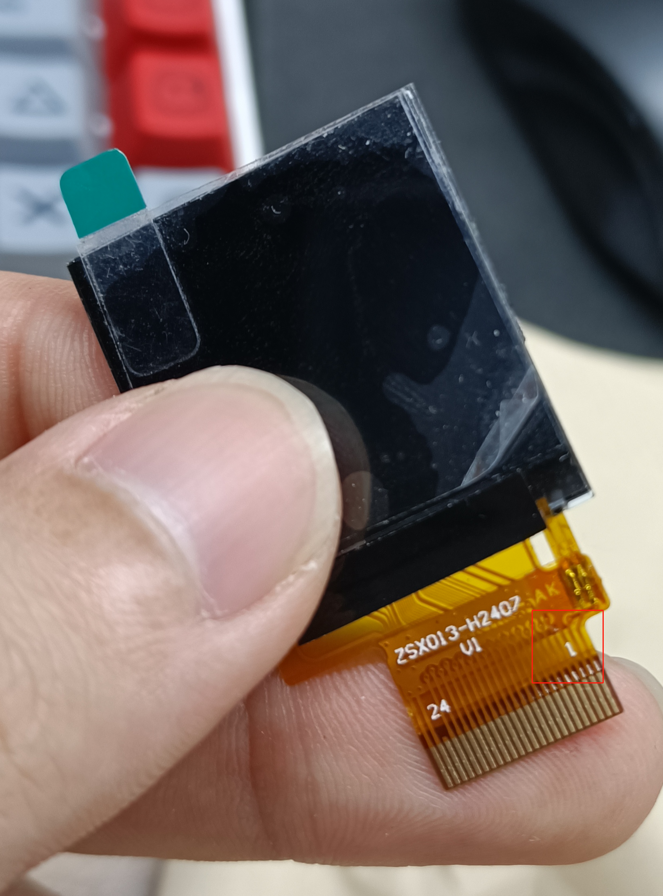
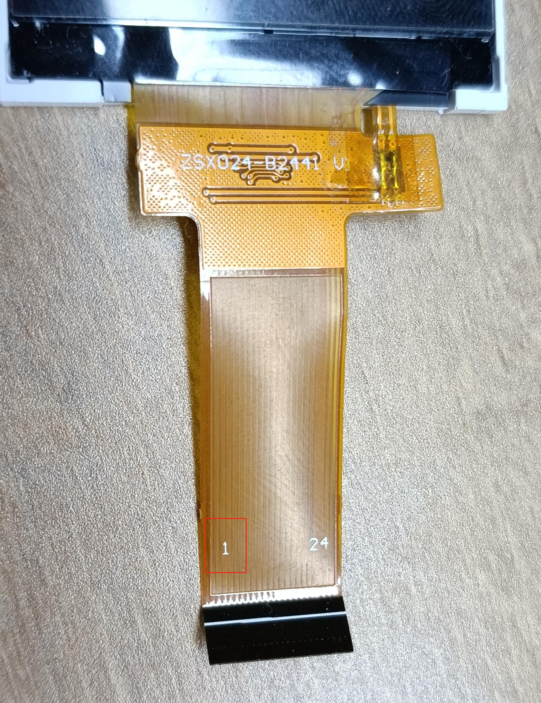

这个关于 V831 开发板的一些额外使用事项介绍，和使用方法

## 切换屏幕

目前开发板支持的屏幕有 1.3寸、2.4寸、2.8寸的 spi 屏和5存的 RBG 屏幕，而且只是支持在我们淘宝上购买的显示屏，对于别的屏幕有需求的，可以走商务通道进行定制。

### 准备

- 需要切换的屏幕
- 开发板
- 编译好的设备树文件，可以在[下载站](https://dl.sipeed.com/shareURL/MaixII/MaixII-Dock/SDK/Toolchain)中进行下载

### 切换设备树

> update_dtb 程序是给 allwiner tina linux 专门写的小工具。

将设备树文件放到开发板中的任意位置，在设备树文件所在的位置运行

    update_dtb /dev/mmcblk0 sipeed_320240_sp2305.dtb

即可切换设备树，该设备树文件是通过内核编译出来的，不推荐个人用户自行编译

| 文件名字 | 可用屏幕 |
| :----: | :----: |
| sipeed_320240_sp2305.dtb | 2.4寸和2.8寸 |
| sipeed_240240_sp2305.dtb | 1.3寸 |

### 屏幕连接

开发板连接1.3寸屏幕是可以直接连接，但是如果想要连接2.4寸和2.8寸屏幕，是需要使用转接板的

转接板上的接口一个 1 的标识符，这个标识符是用来辨别屏幕的接线的正反，屏幕排线上的 1 要和转接板、开发板的上 1 ，位置对应，都要在同一边

