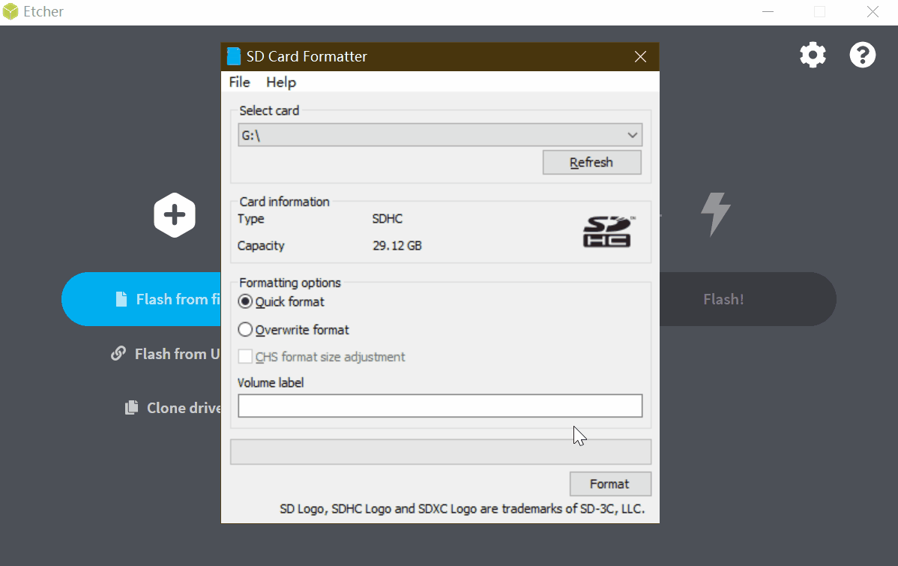
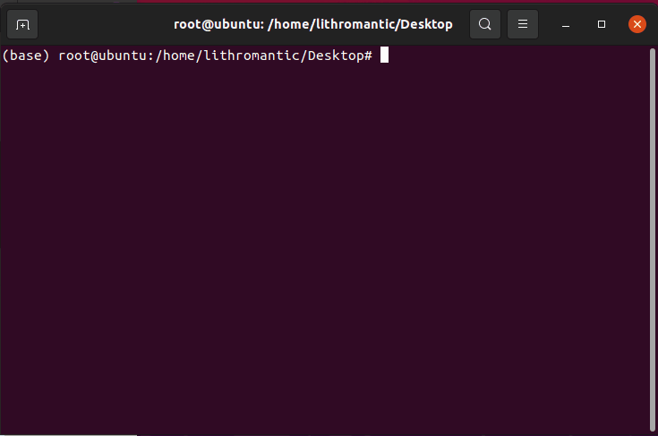
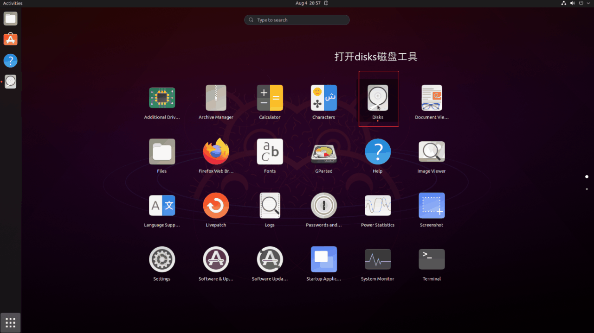

# 系统烧录

## 系统简介

Lichee MaixSense（以下简称R329）提供了以下两种系统镜像

|   名称   |               armbian               |               Tina               |
| :------: | :---------------------------------: | :------------------------------: |
|   简介   | 专门用于`ARM`开发板的轻量级`Debian` |    全志魔改OpenWRT1404的系统     |
|   特点   |        主线化Linux，功能丰富        |        厂商魔改，比较精简        |
| 适用人群 |       极客，嵌入式入门玩家等        | 深度开发，需要自行定制等开发人员 |

> ！！！一定要严格按照步骤操作！！！armbian系统请使用大于 4G 的 TF/SD 卡进行烧录，tina系统请使用大于 1G 的 TF/SD 卡进行烧录

R329 为全志的 SOC，所以 Windows 使用 PhoenixCard，Linux 上使用 Livesuit 烧录镜像文件。

## Tina 系统烧录

Tina 系统需要自己进行编译，具体编译方式参考<https://github.com/sipeed/R329-Tina-jishu>

Tina 系统的烧录方式和 MaixII dock通用，可参考[MaixII M2dock 烧录系统 - Sipeed Wiki](https://wiki.sipeed.com/soft/maixpy3/zh/install/maixii_m2dock/flash.html#windows-phoenixcard)，这里不多做介绍

## armbian 系统烧录

armbian 镜像获取：

> 链接：https://eyun.baidu.com/s/3i7j4iqT 密码：sipeed

armbian 使用的烧录方式为 dd，windows下推荐使用 Etcher，linux 下推荐使用 Terminal。

### windows 下系统烧录

资源获取：

​	下载[Etcher](https://www.balena.io/etcher/ "Etcher")

​	下载[SD Card Formatter](https://www.sdcard.org/downloads/formatter/eula_windows/SDCardFormatterv5_WinEN.zip "SDCardFormatter")

首先解压镜像，得到 .img 镜像文件，然后使用 SD Card Formatter 格式化sd卡，打开Etcher，点击 `Flash from file` ,选中dd镜像包，然后点击 `Select target` 选中sd卡，最后点击 `Flash` 烧录。 

### linux下系统烧录

首先解压镜像，得到 .img 镜像文件，然后格式化 sd 卡，打开 Terminal ，输入  `sudo dd if = xxx.img of=/dev/sdx bs=1M status=progress oflag=direct`烧录。注意xxx.img为文件名，  `/dev/sdx`为sd卡实挂载位置。

同时也可以直接使用 Disks 进行更便捷的烧录（需要Ubuntu桌面版)：

烧录完毕后，即可放入Lichee MaixSense中运行。

# 访问串口

> 请将 USB口插入到 USB UART 口(下面的口）从而获得串口。

## Linux & macOS

Linux 不需要装驱动，系统自带了，使用 `ls /dev/ttyUSB*` 即可看到设备号

## Windows

`Lichee MaixSense` 使用了 `CH340` 作为驱动芯片。`Windows` 用户需要安装 `CH340` 的驱动。

Windows 下载 [ch340 ch341 driver](https://api.dl.sipeed.com/shareURL/MAIX/tools/ch340_ch341_driver) 安装即可，然后可以在 `设备管理器` 中看到串口设备