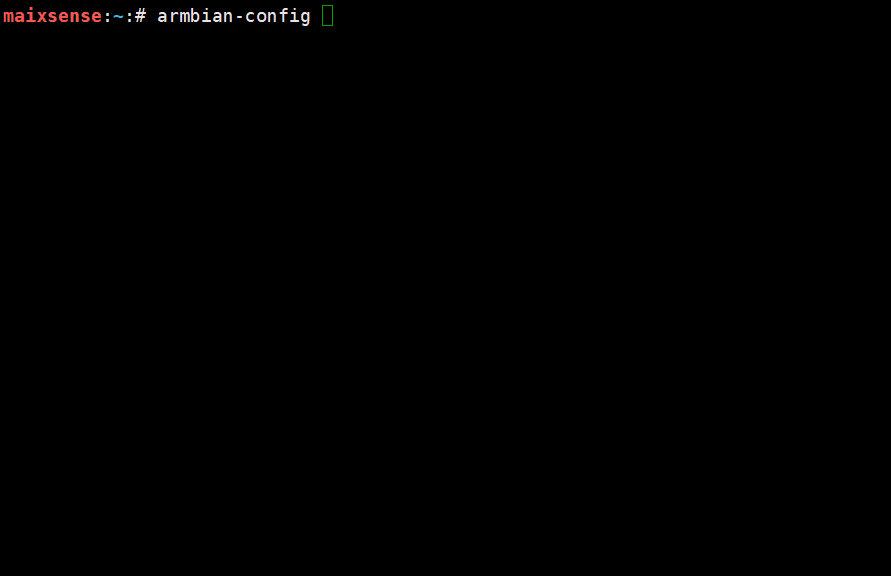
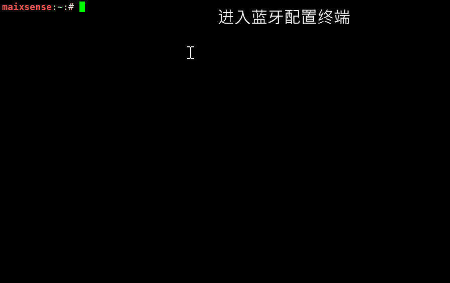
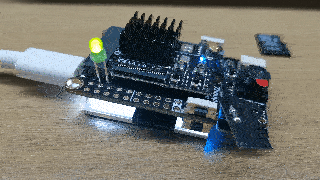

# Armbian 配置及使用

## 配置网络

`nmtui`


## 配置SSH连接

系统已默认开启了ssh和ftp，直接连接即可。

## 配置APT源

打开`armbian-config`，选中Personal，选择Mirrors，找到合适的apt源，按住TAB键切换到ok，保存即可。		



## 设置时区

打开`armbian-config`，选中Personal，选择Timezone > Asia >Shanghai设置上海时间（不用找，Debian没有北京时间），按住TAB键切换到ok，保存即可。		


## 设置中文显示

打开`armbian-config`，选中Personal >Locales>下滑到最下面，空格选中zh.GBK和zh.UTF-8,，然后勾选zh_CN.UTF8设置为系统默认语言，按住TAB键切换到ok，保存，exit退出，下载中文字体，`apt-get install fonts-wqy-zenhei`，重启后系统环境就变成中文的了。


## 配置蓝牙

打开`armbian-config`，选中Network，选择BTinstall安装蓝牙支持包。


然后安装RT8723ds的蓝牙驱动

> https://github.com/Icenowy/armbian-firmware/tree/8723ds_bt/rtl_bt
> 8723ds 蓝牙固件是这里面 rtl8723ds 开头的
> [rtl8723ds_config.bin](https://github.com/Icenowy/armbian-firmware/blob/8723ds_bt/rtl_bt/rtl8723ds_config.bin)和[rtl8723ds_fw.bin](https://github.com/Icenowy/armbian-firmware/blob/8723ds_bt/rtl_bt/rtl8723ds_fw.bin)
>
> 放到 /lib/firmware/rtl_bt

可以使用Xftp传输，安装完毕后断电重启即可。

然后就可以使用Bluetoothctl配置蓝牙。

常用命令：

```
devices             		列出活动的蓝牙设备
paired-devices      		列出已配对蓝牙设备
pairable <on/off>   		是否允许配对
discoverable <on/off>       是否允许被发现
discoverable-timeout [value]设置暴露时间
pair [dev]                  配对设备
trust [dev]                 信任设备
untrust [dev]               取消设备信任
remove <dev>                移除设备
connect <dev>               连接设备
disconnect [dev]            断开设备连接                      
quit                        退出
help          				查看帮助
```

### 连接蓝牙设备

使用`bluetoothctl`连接蓝牙设备。

```
scan on #扫描设备
scan off #停止扫描
trust XX:XX:XX:XX # 信任设备
pair XX:XX:XX:XX #配对设备
connect XX:XX:XX:XX #连接设备
```




### 设置蓝牙音频输入/输出

启用蓝牙音频前，需要先安装`pulseaudio`即及蓝牙组件

```
apt install pulseaudio
apt install pulseaudio-module-bluetooth
```

然后使用pactl查看是否有蓝牙输出设备

```
pactl list short sinks
```

切换音频输出到蓝牙

```
pactl set-default-sink <dev>
```

log如下：

```
maixsense:~:# apt install pulseaudio
maixsense:~:# apt install pulseaudio-module-bluetooth
maixsense:~:# pactl list short sinks
0	alsa_output.platform-7032000.codec.stereo-fallback	module-alsa-card.c	s16le 2ch 44100Hz	SUSPENDED
2	bluez_sink.00_26_04_00_73_B1.a2dp_sink	module-bluez5-device.c	s16le 2ch 44100Hz	SUSPENDED
maixsense:~:# pactl set-default-sink 2 
```


然后就可以播放音频到蓝牙设备，或者通过蓝牙连接手机当作蓝牙音箱使用。

## 配置音量

`alsamixer`


常用命令

```
------------------- Help-----------------------
xxEsc     离开                                ▒x
xxF1 ? H  帮助                                ▒x
xxF2 /    系统信息                            ▒x
xxF3      回放控制                            ▒x
xxF4      捕获控制                            ▒x
xxF5      所有控制                            ▒x
xxTab     切换显示模式                        ▒x
xxF6 S    选择声卡                            ▒x
xxL       刷新屏幕                            ▒x
xxLeft    移动到上一个的控制                    ▒x
xxRight   移动到下一个的控制                    ▒x
xxUp/Down    改变音量                         ▒x
xx+ -        改变音量                         ▒x
xxPage Up/Dn 大幅改变音量                      ▒x
xxEnd        设置音量为0                       ▒x
xx0-9        从0到9依次设置音量                 ▒x
xxQ W E      增加 左/全部/右声道音量            ▒x
xxZ X C      减少 左/全部/右声道音量            ▒x
xxB          左右声道平衡                      ▒x
xxM          切换静音                         ▒x
x< >         切换左/右静音                     ▒x
xxSpace      切换捕获                         ▒x
xx; '        切换左/右捕获                     ▒x
-----------------------------------------------
```

如果需要控制蓝牙设备音量，需要使用`pactl` ，并且`pcatl`也支持控制声卡，所以推荐使用此app控制音量。

```
查看输入/输出设备索引
pactl list short sources/sinks
##设置输入/输出音量
pactl set-source/sink-volume index volume
pactl set-default-source/sink
设置默认输入/输出
```

示例，设置蓝牙耳机为输出设备，音量为10%,然后增加20%，最后减少30%

```
maixsense:~:# pactl list short sinks
0	alsa_output.platform-7032000.codec.stereo-fallback	module-alsa-card.c	s16le 2ch 44100Hz	SUSPENDED
2	bluez_sink.00_26_04_00_73_B1.a2dp_sink	module-bluez5-device.c	s16le 2ch 44100Hz	RUNNING
##蓝牙设备一般为bluez_sink
maixsense:~:# pactl set-default-sink 2
maixsense:~:# pactl set-sink-volume 2 10%  
maixsense:~:# pactl set-sink-volume 2 +8192  
maixsense:~:# pactl set-sink-volume 2 -0x3000
##可选 百分比，十进制数，十六进制数控制，效果相同，并且可以超过100%
```

## 媒体播放

媒体播放常用mplayer

apt下载mplayer`apt install mplayer`

然后执行`mplayer badapple_240p.mp4 -vo fbdev2`播放视频

或者`mplayer G.E.M.邓紫棋\ -\ 光年之外.flac`播放音频

在后面加上`< /dev/null > /dev/null 2>1 &`以便在后台播放


## 编写c代码

```
vim helloworld.c
i
#include <stdio.h>
int main()
{
            printf("Hello, world\n");
            return 0;
}
esc
:wq
gcc hello.c -o hello.o
./hello.o
```


## 编写python代码

```
vim helloworld.py
i
print("hello world!\n")
esc
:wq
python3 helloworld.py
```


## 运行神经网络实例

获取1000类物体分类模型

下载站链接[zhouyi_test.tar.xz](https://dl.sipeed.com/shareURL/MaixII/MaixII-A/example),使用任意方式上传到板子中

```
##解压压缩包
tar -xvf zhouyi_test.tar.xz
##授予执行权限
cd zhouyi_test
chmod 777 run.sh
##执行1000类物体分类
./run.sh
##后台执行1000类物体分类
./run.sh < /dev/null > /dev/null 2> 1 
```

## 使用python点亮第一个灯

安装GPIO的python支持库

```
pip install gpiod
```

把led正极插入PH5,负极插入GND

编写代码

``` 
vim led.py
```

复制代码进去

```
import time
import gpiod as gpio
PH_BASE = (8-1)*32 # "PH"
gpiochip1 = gpio.chip("gpiochip1")
led = gpiochip1.get_line((PH_BASE + 5)) # "PH5"
config = gpio.line_request()
config.request_type = gpio.line_request.DIRECTION_OUTPUT
led.request(config)

while led:
    led.set_value(0)
    time.sleep(1)
    print("led on")
    led.set_value(1)
    time.sleep(1)
    print("led off")
```

执行代码

 ```
 python3 led.py
 ```

效果如下：



## 设置开机启动

启用开机自启动脚本

```
vim /lib/systemd/system/rc-local.service
```

在最后面添加

```
[Install]
WantedBy=multi-user.target
Alias=rc.local.service
```

编辑自启动脚本

 ```vim
 vim /etc/rc.local
 ```

在`exit 0`前面添加需要启动的服务

```
mplayer /root/badapple_240p.mp4 -vo fbdev2  < /dev/null > /dev/null 2>1 &
python3 /root/helloworld.py
```

然后重启即可

注意，此脚本会在用户登录前执行，执行日志如下

```
[  OK  ] Finished Permit User Sessions.
[   38.569457] rc.local[1322]: hello world!
```

## 更多的使用方法
请到[MaixPy3](./../../../../../../soft/maixpy3/zh/readme.md)和[极术社区](https://aijishu.com/a/1060000000221780)中自行查看