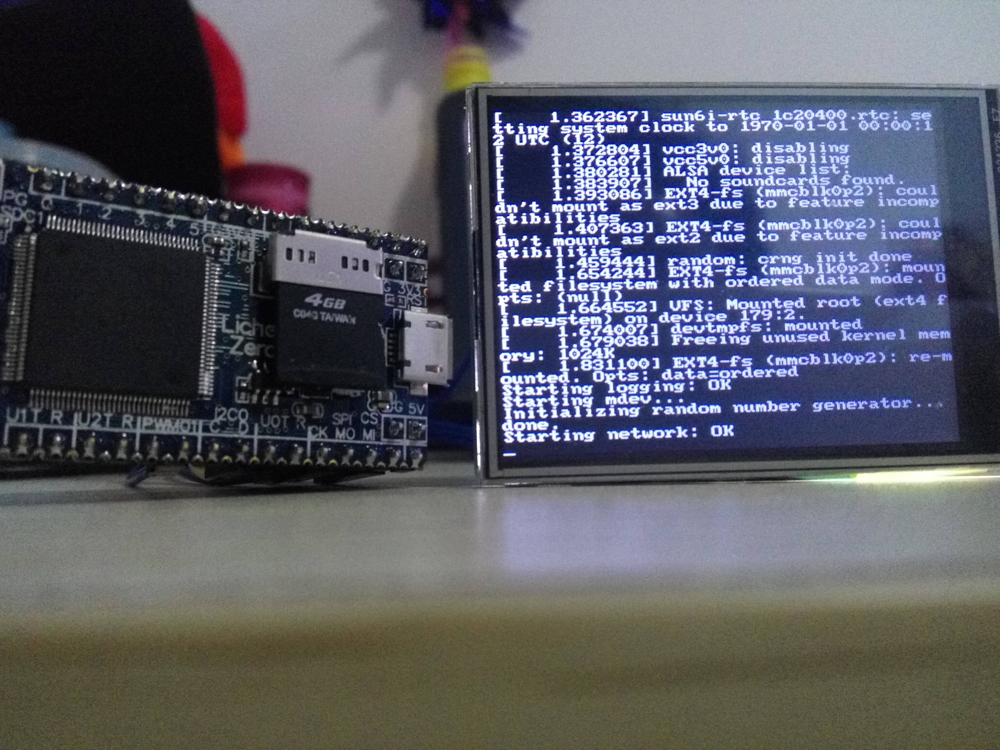

在阅读本文之前，首先要保证你能够成功的编译linux内核，并构建一个完整的根文件系统。关于这部分的知识，之后还会单独写一个文档讨论。

其实lichee pizero使用的4.10内核已经包含了市面上常见的SPI液晶屏的驱动（fbtft），我们所要做的仅仅是在设备树中添加节点。说起fbtft，它之前独立于内核存在过一段时间，作为单独的代码文件发布，如果你需要它，可以手动把这部分文件复制到内核源码中\<参考 [fbtft的 github仓库](https://github.com/notro/fbtft)\>。后来被并入内核，具体是在哪一个版本的被并入内核的，这个也不必深究了。不过目前为止fbtft并未转正，依然存放在drivers/staging目录中。

## 配置内核添加fbtft驱动


使用make menuconfig配置内核，加入ili9341驱动。fbtft还支持更多型号的SPI总线的液晶屏。关于支持列表这里就不一一列出，可以进入menuconfig中查看。

```
Device Drivers  --->
    [*] Staging drivers  --->
        <*>   Support for small TFT LCD display modules  --->
                <*>   FB driver for the ILI9341 LCD Controller
                <*>   Generic FB driver for TFT LCD displays
```

编译内核：

> `make -j4`

## 修改设备树注册ili9341


lichee pi zero默认注册40Pin RGB液晶屏，并且在启动参数中设置console为tty0。为了尽可能减少改动，我们在设备树中删除了默认的40Pin液晶屏，这样新添加的ili9341也就顺利成章的成了唯一的太子，启动时的信息会通过他显示。

下面是使用git对比改动前后的细节：

```
diff --git a/arch/arm/boot/dts/sun8i-v3s-licheepi-zero.dts b/arch/arm/boot/dts/sun8i-v3s-licheepi-zero.dts
index 929a79e..9c91f75 100644
--- a/arch/arm/boot/dts/sun8i-v3s-licheepi-zero.dts
+++ b/arch/arm/boot/dts/sun8i-v3s-licheepi-zero.dts
@@ -90,3 +90,21 @@
        usb0_id_det-gpio = <&pio 5 6 GPIO_ACTIVE_HIGH>;
        status = "okay";
};
+
+&spi0 {
+       status = "okay";
+
+       ili9341@0 {
+               compatible = "ilitek,ili9341";
+               reg = <0>;
+
+               spi-max-frequency = <15000000>;
+               rotate = <270>;
+               bgr;
+               fps = <10>;
+               buswidth = <8>;
+               reset-gpios = <&pio 1 7 GPIO_ACTIVE_LOW>;
+               dc-gpios = <&pio 1 5 GPIO_ACTIVE_LOW>;
+               debug = <0>;
+       };
+};
diff --git a/arch/arm/boot/dts/sun8i-v3s.dtsi b/arch/arm/boot/dts/sun8i-v3s.dtsi
index 50b8788..b0eb22e 100644
--- a/arch/arm/boot/dts/sun8i-v3s.dtsi
+++ b/arch/arm/boot/dts/sun8i-v3s.dtsi
@@ -54,15 +54,6 @@
                #address-cells = <1>;
                #size-cells = <1>;
                ranges;
-
-               simplefb_lcd: framebuffer@0 {
-                       compatible = "allwinner,simple-framebuffer",
-                                    "simple-framebuffer";
-                       allwinner,pipeline = "de0-lcd0";
-                       clocks = <&ccu CLK_BUS_TCON0>, <&ccu CLK_BUS_DE>,
-                                <&ccu CLK_DE>, <&ccu CLK_TCON0>;
-                       status = "disabled";
-               };
```


-   dc-gpios = \<&pio 1 5 GPIO\_ACTIVE\_LOW\>;

在设备树中，PA对应&pio 0, PB对应&pio 1，
以此类推。因此dc-gpios实际表示的是PB5，也就是zero丝印上的PWM1。

-   reset-gpios = \<&pio 1 7 GPIO\_ACTIVE\_LOW\>;

如果我的屏幕的RESET引脚连接了高电平，或者接了一个RC回路作为上电复位的信号，那么这里的复位引脚是不是可以不指定呢？

这样也是不可以的。因为在程序中，首先读取reset-gpios，若reset-gpios在设备树中不存在，那么直接忽略其余的信号。这样导致无法控制最关键的dc-gpios引脚。因此至少在不更改程序的前提下，这条信号是一定要写上的。

```
static int fbtft_request_gpios_dt(struct fbtft_par *par)
{
    int i;
    int ret;

    if (!par->info->device->of_node)
        return -EINVAL;

    ret = fbtft_request_one_gpio(par, "reset-gpios", 0, &par->gpio.reset);
    if (ret)
        return ret;
    ret = fbtft_request_one_gpio(par, "dc-gpios", 0, &par->gpio.dc);
    if (ret)
        return ret;
```

## 更新SD卡中的程序


假设你之前已经创建好了一张可以正确启动的SD卡，那么你要做的很简单：

> 将 **arch/arm/boot/zImage** 和
> **arch/arm/boot/dts/sun8i-v3s-licheepi-zero.dtb**
> 拷贝到SD卡中的vfat分区，覆盖之前的程序即可。

## 硬件连接


## 上电启动


linux内核启动时会加载fbtft驱动，注册framebuffer设备，打印如下信息：

```
[    0.860671] fbtft_of_value: buswidth = 8
[    0.864653] fbtft_of_value: debug = 0
[    0.868325] fbtft_of_value: rotate = 270
[    0.872252] fbtft_of_value: fps = 10

[    1.244063] graphics fb0: fb_ili9341 frame buffer, 320x240, 150 KiB video memory, 16 KiB DMA buffer memory, fps=10, spi32766.0 at 15 MHz
```

显示效果如下图：



