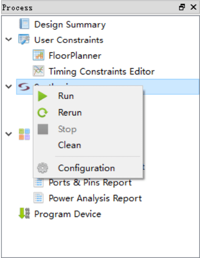
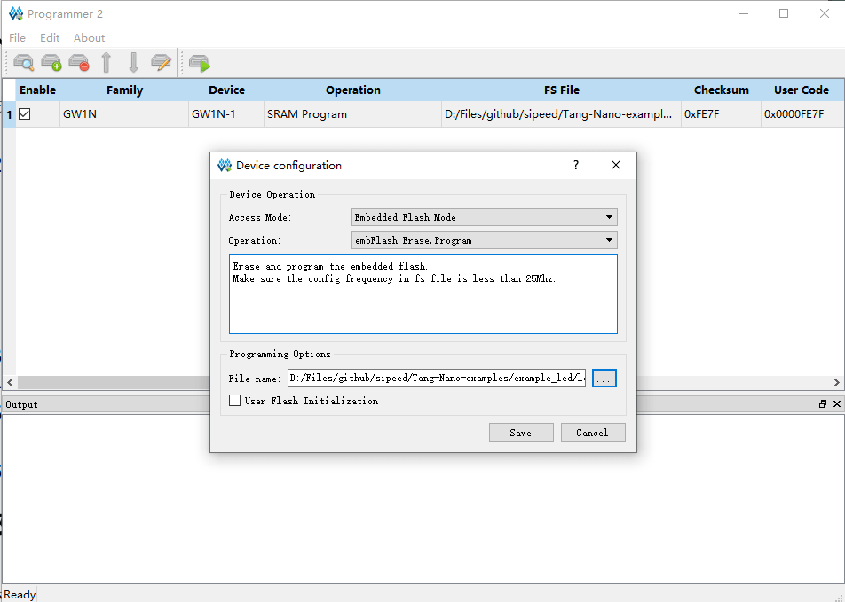

# 点灯
## 本实例的过程

新建工程 -> 添加源代码文件 -> 添加时序、引脚约束 -> 综合 -> 烧录

在看这篇文档前，请再次确定自己看过[Gowin云源软件用户指南](http://cdn.gowinsemi.com.cn/SUG100-1.8_Gowin%E4%BA%91%E6%BA%90%E8%BD%AF%E4%BB%B6%E7%94%A8%E6%88%B7%E6%8C%87%E5%8D%97.pdf)，第5章 云源软件使用

本实验的源码地址：[https://github.com/sipeed/Tang-Nano-examples/tree/master/example_led](https://github.com/sipeed/Tang-Nano-examples/tree/master/example_led)

## Verilog 预备知识

这里只介绍接下来会用到的相关语法，更多的可以参考《Verilog 数字系统设计教程》

Verilog 的基本设计单元是模块，每个 Verilog 程序包括 4个 主要部分：端口定义、I/O说明、内部信号声明和功能定义

模块就像我们平时提到的黑匣子，当我们实现了模块后，就不需要去关心模块内部，只需要根据模块定义的输入输出格式，将模块实例化，给模块提供输入，就可以让模块自己工作了

一个模块长成这样

```
module block (input a, output b);
reg [width-1:0] R_1;

assign b = a;
always @(posedge clk or negedge reset_n)
begin
// do something
end

endmodule
```

模块整体结构由 module 和 endmodule 组成，module 后面跟着的是模块接口的定义，声明了端口的方向是输入还是输出

模块内部有时候会使用内部的信号，内部信号有 wire 和 reg 类型

功能的定义可以通过 assign 和 always块 完成。 assign 是描述组合逻辑最常用的方法之一； always 块机可用于描述组合逻辑，也可描述时序逻辑

## 引脚使用情况

板载的是一颗三色 RGB 灯，原理图如下


整个程序使用到的引脚分布如下

| port      | I/O    | pin | desc       |
| --------- | ------ | --- | ---------- |
| sys_clk   | input  | 35  | 时钟输入脚 |
| sys_rst_n | input  | 15  | 系统复位脚 |
| led[0]    | output | 16  | 绿灯       |
| led[1]    | output | 17  | 蓝灯       |
| led[2]    | output | 18  | 红灯       |

## 程序设计

本系统时钟为 24Mhz，一个机器周期为 1/24M s，也就是说每过 12000000 个时钟周期为 0.5s

在程序中通过 counter 计算 12000000 个时钟周期，实现 0.5s 的等待，等时间到了之后将 counter 置 0，并改变 LED 的颜色

```
module led (
    input sys_clk,          // clk input
    input sys_rst_n,        // reset input
    output reg [2:0] led    // 110 G, 101 R, 011 B
);

reg [23:0] counter;

always @(posedge sys_clk or negedge sys_rst_n) begin
    if (!sys_rst_n)
        counter <= 24'd0;
    else if (counter < 24'd1200_0000)       // 0.5s delay
        counter <= counter + 1;
    else
        counter <= 24'd0;
end

always @(posedge sys_clk or negedge sys_rst_n) begin
    if (!sys_rst_n)
        led <= 3'b110;
    else if (counter == 24'd1200_0000)       // 0.5s delay
        led[2:0] <= {led[1:0],led[2]};
    else
        led <= led;
end

endmodule
```

## 引脚约束

要想让 fpga 实现代码的功能，还需要将代码中涉及的引脚操作约束到 fpga 实际的引脚上

如下图，在左边的工作区点击 process，然后双击 FloorPlanner


在工程中第一次点击，可能会提示说创建文件，点击确定即可

在弹出窗口中，切换到 Package View ，将 Ports 下的端口拖到 fpga 对应的引脚上，保存即可，如下图


## 综合

在左侧的工作区中，右键 Synthesize 或 Place&Route 时，会有 run 的选项，点击即可



## 烧录到开发板

有两种选择，一种是烧录到 sram 中，一种是烧录到 flash 中

烧录到 sram 中比较快，但是掉电后 fpga 中就没有固件了；烧录到 flash 中可以在系统掉电后保存之前烧录的固件

烧录是通过 Programer 完成的

双击左侧工作区的 Program Device 就可以打开 Programer


不过在使用 Programer 前需要注意，要在 Synthesize 和 Place&Route 都完成后才能使用 Programer ，否则软件会报错 `Bitstream file dose not exists`


Linux 用户需要注意

> Linux 安装包中的编程器适用于 Linux 版本 Red Hat 5.10，如需 Red Hat 6/7 版本的编程器，请到官网上下载安装后，将安装包替换为 Gowin 云源软件安装包中的文件夹“Programmer”。

### 更改烧录位置

要选择固件烧录的位置，可以在选中芯片的情况下，点击 Edit -> Configure Device


在弹出窗口中选择自己需要烧录到的位置，这里选择的是 flash ，默认烧录位置是 sram



### 烧录

在选择好烧录位置后，就可以烧录固件了，点击菜单栏的烧录即可


