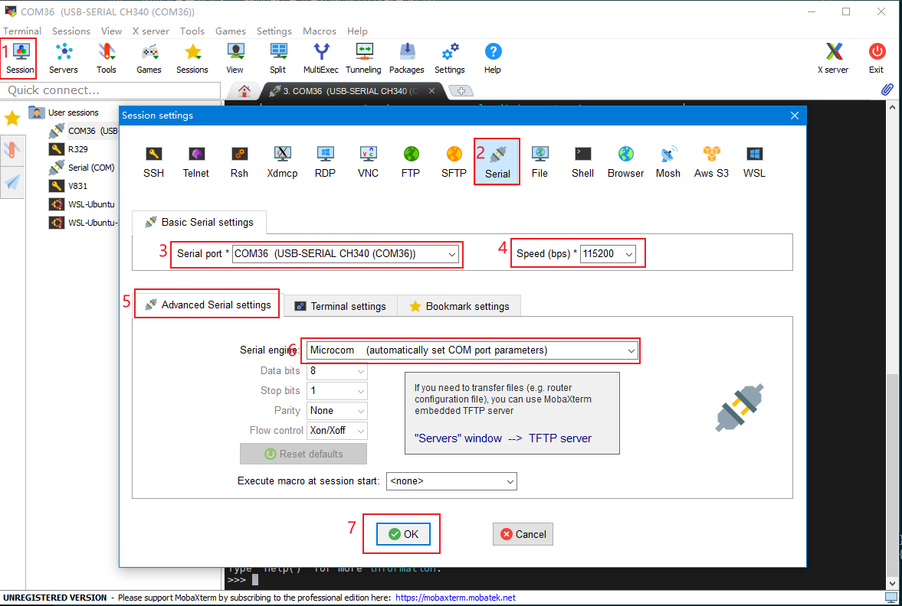
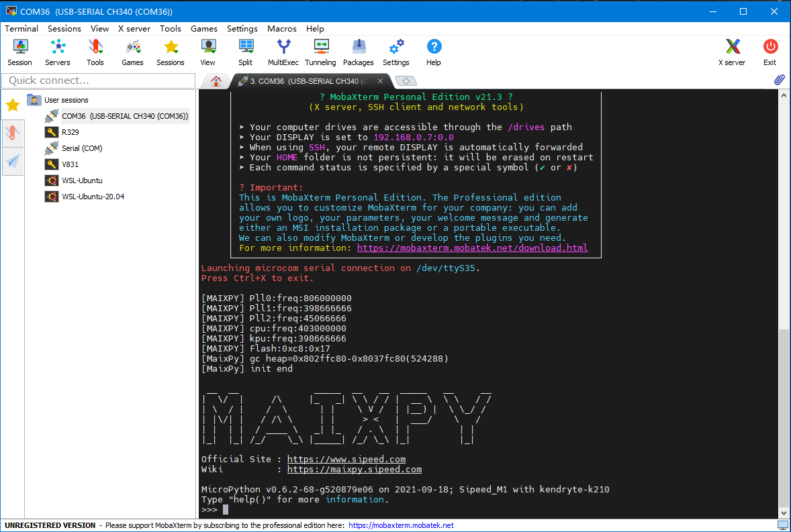
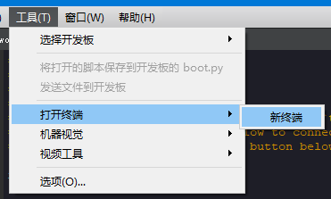
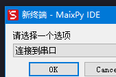
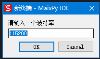
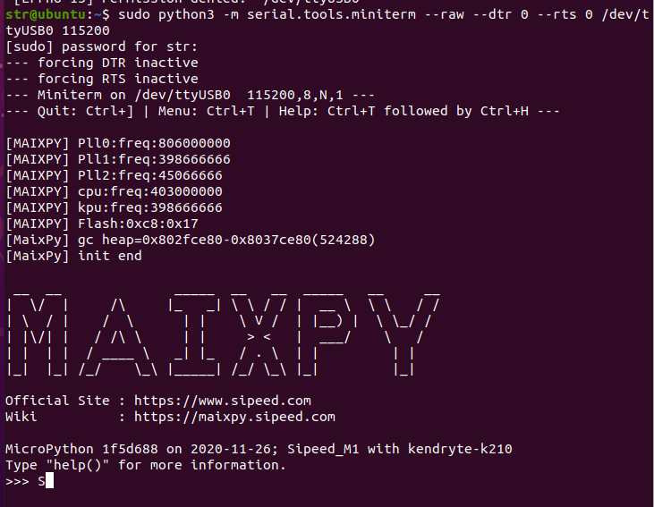

## 连接硬件

连接 Type C 线， 一端电脑一端开发板

查看设备是否已经正确识别：

在 Linux 下可以通过 `ls /dev/ttyUSB*` 或者 `ls /dev/ttyACM*` 来查看， 如果没有可以 `ls /dev` 来找找，具体的设备名跟串口芯片和驱动有关. 也可以用`sudo dmesg`来看是否有设备挂载记录

在 Windows 下可以打开设备管理器来查看

如果没有发现设备， 需要确认有没有装驱动以及接触是否良好

## 使用串口工具

### Windows

Windows 常用的串口终端软件有 [mobaxterm](https://mobaxterm.mobatek.net/)，[xshell](https://xshell.en.softonic.com/)，[mpfshell-lite](./mpfshell-lite/mpfshell-lite.md) 等工具

#### Mobaxterm

[MobaXterm](https://mobaxterm.mobatek.net/) 是 Windows 下一款非常好用的多功能终端软件（当然也包括串口终端）

#### mpfshell-lite
[mpfshell-lite](./mpfshell-lite/mpfshell-lite.md)是一款体积迷你，功能齐全的 MicroPython 管理工具，可以对flash、sd卡的文件进行管理，也可以进行micropython的编写。

#### MaixPy IDE终端工具

打开 MaixPy IDE，在 IDE 没有连接板子的时候选择通过串口终端进入开发板

### Linux

使用 python 中的 pyserial 进行开发板的连接

- 安装 pyserial 

    sudo python3 -m pip install pyserial

- 连接开发板

    sudo python3 -m serial.tools.miniterm --raw --dtr 0 --rts 0 /dev/ttyUSB0 115200

- 复位开发板

通过按两次键盘上的，CTRL+T 和 CTRL+R，可实现复位

- 退出串口

按键盘上的 CTRL + ]

> 可以通过运行 `sudo usermod -a -G dialout $(whoami)` ，添加用户的使用权限，然后重启系统，后面使用 pyserial 打开串口就可以不使用 sudo 权限了