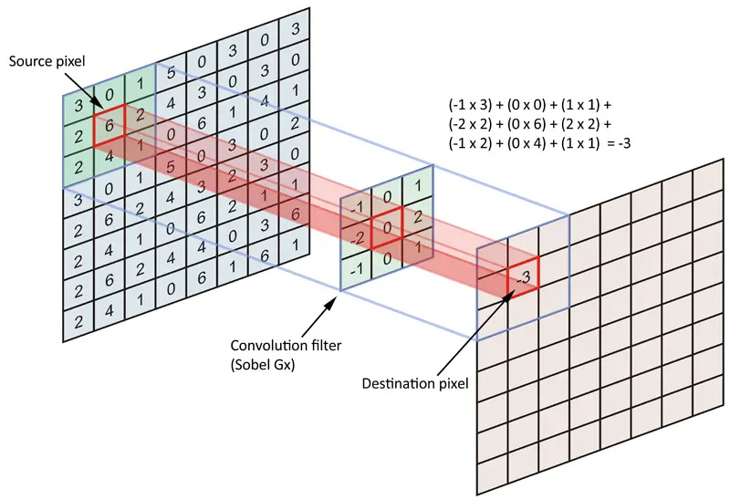

# 边缘检测

Pytorch 使用模型(卷积/conv)实现 sobel(索贝尔) 边缘检测实现源码

> 目前只能在 V831 上进行部署使用，R329 后续会更新上来

## 边缘检测效果


源码在末尾

## 边缘检测原理
边缘就是值变化剧烈的地方, 如果对值的变化求导, 则边缘部分就是导数局部最大.
但是在图像处理时没有具体的函数让我们求导, 使用卷积运算则可以很好的近似替代

如下图, 假设左上为坐标原点, 横轴为 `x`, 纵轴为`y`, 如下图左上角9个像素点, `P(x, y)`表示坐标`(x, y)`的点, 要求`P(1, 1)`处在x轴的变化率, 则只需将`P(2, 1) - P(0, 1)` 得到值为`0`, `P(1, 0)`处为`1-3 = -2,` 这个差值即变化率, 类比成导数, 我们就能知道横轴在哪些地方变化率更大.

上面这种方法我们可以得到横轴的变化率, 这里使用卷积核
```
[-1, 0, 1],
[-2, 0, 2],
[-1, 0, 1]
```
对图像进行卷积运算, 如图中的计算方法, 像素点左右权值取2, 角上的也参与计算,但是权值为1,没有左右边的权值高. 这样我们就得到了横轴的变化率图, 即边缘检测图.

注意, 这里是对横轴计算了, 比较的点左右的值变化, 所以实际看到的图像会出现明显的纵轴边缘, 如下图左边

同理, 上图右边的图使用卷积核

[1,2,1],
[0,0,0],
[-1, -2, -1]
得到的纵轴的边缘图.

注意这里用右边减左边, 如果右边的值比左边的小会是负数, 如果我们希望只检测颜色值变大(变白)则可以直接使用, 如果两个变化方向都要检测, 则可以取绝对值. 比如下图左边是没有取绝对值, 右边取了绝对值

得到两个方向的图后, 对其进行合并, 对每个像素平方和开方即可

这张图左边是使用 GIMP 的 sobel 边缘检测(垂直+水平)的效果, 略微有点不同:

不同的原因是使用水平和垂直的图平方和开根后, 直接用 `plt.imshow` 显示, 和 GIMP 的处理方式不同
```python
out = np.sqrt(np.square(out_v) + np.square(out_h))
plt.imshow(out)
```
简单地直接将值规范到`[0, 255]`就和 GIMP 的图相似了(但不完全一样)
```python
out = np.sqrt(np.square(out_v) + np.square(out_h))
out = out * 255.0 / out.max()
plt.imshow(out.astype(np.uint8))
```

## 自定义卷积核来实现边缘检测
除了上面说了使用两次卷积计算, 也可以用只计算一次的卷积核, 比如:
```bash
[-1, -1, -1],
[ -1, 8, -1],
[ -1, -1, -1]
```
这是对于一个通道(灰度图)来说, 如果要扩充到三个通道(RGB), 卷积核参数就是如下形式
```bash
conv_rgb_core_sobel = [
                        [[-1,-1,-1],[-1,8,-1], [-1,    -1,    -1],
                         [0,0,0],[0,0,0], [0,0,0],
                         [0,0,0],[0,0,0], [0,0,0]
                        ],
                        [[0,0,0],[0,0,0], [0,0,0],
                         [-1,-1,-1],[-1,8,-1], [-1,    -1,    -1],
                         [0,0,0],[0,0,0], [0,0,0]
                        ],
                        [[0,0,0],[0,0,0], [0,0,0],
                         [0,0,0],[0,0,0], [0,0,0],
                         [-1,-1,-1],[-1,8,-1], [-1,    -1,    -1],
                        ]]
```
经过卷积运算后, 前后图如下:


注意, 输入值范围如果为`[0, 255]`, 输出值则范围会变化, 以图片形式查看时需要注意加以处理, 这里使用了`plt.imshow(out)`来显示, 这个函数会自动对图像做简单的处理, 才会看起来是黑色背景

## 导出成模型使用
可以将 Net 导出成 onnx 即可在其它平台使用, 就是一个简单的卷积层

部署到 V831 后的样子(使用了卷积核`[-1,-1,-1],[-1,8,-1], [-1,-1,-1],`):


V831 部署[源码]()在 github， 模型在 maixhub 上可以下载

## 边缘检测源码

> 这是在电脑上运行的代码，不是在开发板平台上运行的代码

```python

'''
    simple sobel edge demo
    visit: https://neucrack.com/p/377
    @author neucrack
    @license MIT
'''
import torch
import torch.nn as nn
import numpy as np
import cv2
from PIL import Image
import matplotlib.pyplot as plt
class Net(nn.Module):
    def __init__(self):
        super(Net, self).__init__()
        self.conv1 = nn.Conv2d(3, 3, 3, padding=(0, 0), bias=False)
    def forward(self, x):
        x = self.conv1(x)
        return x
net = Net()
conv_rgb_core_original = [
                        [[0,0,0],[0,1,0], [0,0,0],
                         [0,0,0],[0,0,0], [0,0,0],
                         [0,0,0],[0,0,0], [0,0,0]
                        ],
                        [[0,0,0],[0,0,0], [0,0,0],
                         [0,0,0],[0,1,0], [0,0,0],
                         [0,0,0],[0,0,0], [0,0,0]
                        ],
                        [[0,0,0],[0,0,0], [0,0,0],
                         [0,0,0],[0,0,0], [0,0,0],
                         [0,0,0],[0,1,0], [0,0,0]
                        ]]
conv_rgb_core_sobel = [
                        [[-1,-1,-1],[-1,8,-1], [-1,    -1,    -1],
                         [0,0,0],[0,0,0], [0,0,0],
                         [0,0,0],[0,0,0], [0,0,0]
                        ],
                        [[0,0,0],[0,0,0], [0,0,0],
                         [-1,-1,-1],[-1,8,-1], [-1,    -1,    -1],
                         [0,0,0],[0,0,0], [0,0,0]
                        ],
                        [[0,0,0],[0,0,0], [0,0,0],
                         [0,0,0],[0,0,0], [0,0,0],
                         [-1,-1,-1],[-1,8,-1], [-1,    -1,    -1],
                        ]]
conv_rgb_core_sobel_vertical = [
                        [[-1,0,1],[-2,0,2], [-1,    0,    1],
                         [0,0,0],[0,0,0], [0,0,0],
                         [0,0,0],[0,0,0], [0,0,0]
                        ],
                        [[0,0,0],[0,0,0], [0,0,0],
                         [-1,0,1],[-2,0,2], [-1,    0,    1],
                         [0,0,0],[0,0,0], [0,0,0]
                        ],
                        [[0,0,0],[0,0,0], [0,0,0],
                         [0,0,0],[0,0,0], [0,0,0],
                         [-1,0,1],[-2,0,2], [-1,    0,    1],
                        ]]
conv_rgb_core_sobel_horizontal = [
                        [[1,2,1],[0,0,0], [-1, -2, -1],
                         [0,0,0],[0,0,0], [0,0,0],
                         [0,0,0],[0,0,0], [0,0,0]
                        ],
                        [[0,0,0],[0,0,0], [0,0,0],
                         [1,2,1],[0,0,0], [-1, -2, -1],
                         [0,0,0],[0,0,0], [0,0,0]
                        ],
                        [[0,0,0],[0,0,0], [0,0,0],
                         [0,0,0],[0,0,0], [0,0,0],
                         [1,2,1],[0,0,0], [-1, -2, -1],
                        ]]
def sobel(net, kernel):
    sobel_kernel = np.array(kernel,    dtype='float32')
    sobel_kernel = sobel_kernel.reshape((3,    3,    3,    3))
    net.conv1.weight.data = torch.from_numpy(sobel_kernel)
params = list(net.parameters())
img = cv2.imread("out/test.jpg")
input_img = cv2.cvtColor(img, cv2.COLOR_BGR2RGB)
input_tensor = (input_img.astype(np.float32) - 127.5) / 128 # to [-1, 1]
input_tensor = torch.Tensor(input_tensor).permute((2, 0, 1))
print(input_tensor.shape)
input_tensor = input_tensor.unsqueeze(0)
print("input shape:", input_tensor.shape)
sobel(net, conv_rgb_core_sobel)
out = net(input_tensor).detach().numpy()[0].transpose([1,2,0])
sobel(net, conv_rgb_core_sobel_vertical)
out_v = net(input_tensor).detach().numpy()[0].transpose([1,2,0])
sobel(net, conv_rgb_core_sobel_horizontal)
out_h = net(input_tensor).detach().numpy()[0].transpose([1,2,0])
print("out shape: {}, tensor:{}".format(out.shape, out))
print(out.shape, out.max(), out.min())
plt.figure()
plt.figure()
plt.subplot(1, 5, 1)
input = input_tensor.numpy()[0].transpose((1,2,0))
print(input.max(), input.min())
plt.imshow(input_img)
plt.subplot(1, 5, 2)
print(out.max(), out.min())
# out = np.sqrt(np.square(out))
# out = out * 255.0 / out.max()
# out = out.astype(np.uint8)
# print(out.max(), out.min())
plt.imshow(out)
plt.subplot(1, 5, 3)
out = np.abs(out_v)
# out = out * 255.0 / out.max()
# plt.imshow(out.astype(np.uint8))
plt.imshow(out)
plt.subplot(1, 5, 4)
out = np.abs(out_h)
# out = out * 255.0 / out.max()
# plt.imshow(out.astype(np.uint8))
plt.imshow(out)
plt.subplot(1, 5, 5)
out = np.sqrt(np.square(out_v) + np.square(out_h))
# out = out * 255.0 / out.max()
# plt.imshow(out.astype(np.uint8))
plt.imshow(out)
plt.show()
```

## 参考
- [How to implement Sobel edge detection using Python from scratch](http://www.adeveloperdiary.com/data-science/computer-vision/how-to-implement-sobel-edge-detection-using-python-from-scratch/)
- [梯度和Sobel导数](https://blog.csdn.net/lzhf1122/article/details/71752644)

> 以上内容出至于：https://neucrack.com/p/377
