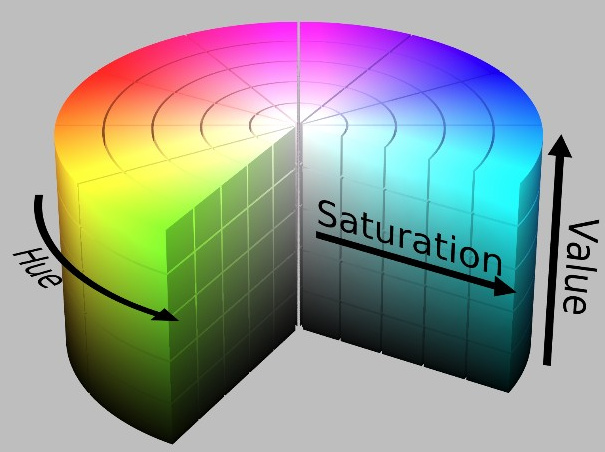

# 图像处理

## 寻找色块

寻找色块可以通过指定 HSV 阈值，进行颜色的确定，下面的例程代码可以通过修改中的函数参数进行修改寻找的颜色， 以下是 Maixpy3 中内置的颜色，可直接进行调用

    green = [(28,-36,-14,68,-5,15)]  #绿色
    red = [(20,22,-3,55,52,42)]    #红色
    yellow = [(35,-6,22,88,5,81)]   #黄色
    blue = [(13, 11, -91, 54, 48, -28)]  #蓝色
    white = [(41,6,-32,74,11,-12)]  #白色
    black = [(10,-3,-28,50,10,-4)]  #黑色

> 以下代码由于 Maixpy3 还在优化中，可能不能运行，具体的代码到 [github](https://github.com/sipeed/MaixPy3) 上查看

```python
from maix import camera, image, display

while True:
    tmp = camera.capture()
    ma = tmp.find_blobs([(28,-36,-14,68,-5,15)]) # 传入需要寻找颜色的 HSV 值
    for i in ma:
        tmp.draw_rectangle(i["x"], i["y"], i["x"] + i["w"], i["y"] + i["h"], (255, 0, 0), 1)
    display.show(tmp)
```


## 获取颜色值

上述寻找颜色的值，可以通过一下的办法进行识别。

> 以下代码由于 Maixpy3 还在优化中，可能不能运行，具体的代码到 [github](https://github.com/sipeed/MaixPy3) 上查看

```python
from maix import camera, image, display

while True:
    img = camera.capture()
    ma = img.get_blob_color((110,110,20,20),1)
    img.draw_string(10, 10, str(ma), 0.5)
    img.draw_rectangle(110,110, 130, 130, (255, 0, 0), 1) 
    display.show(img)
```

# 巡线识别

对于传统的智能小车来说，巡线是一个重要的功能， Maixpy3 中内置了巡线函数

> 以下代码由于 Maixpy3 还在优化中，可能不能运行，具体的代码到 [github](https://github.com/sipeed/MaixPy3) 上查看

```python
from maix import camera, image, display

while True:
    img = camera.capture()
    ma = img.find_line()
    if ma:
        img.draw_line(ma['rect'][0], ma['rect'][1], ma['rect'][2], ma['rect'][3], (255,255,225), 1)
        img.draw_line(ma["rect"][2], ma["rect"][3], ma["rect"][4], ma["rect"][5], (255,255,225), 1)
        img.draw_line(ma["rect"][4], ma["rect"][5], ma["rect"][6], ma["rect"][7], (255,255,225), 1)
        img.draw_line(ma["rect"][6], ma["rect"][7], ma["rect"][0], ma["rect"][1], (255,255,225), 1)
        img.draw_circle(ma["cx"], ma["cy"], 2, (255,255,225), 1)
    display.show(img)
```


颜色在计算机视觉当中是有多种表达形式，如 RBG 、 CMYK、 HSV等

## HSV格式

Maixpy3 中使用的格式是 HSV 格式，通过调整 HSV 中的各个阈值进行识别



- **色调H**
用角度度量，取值范围为0°～360°，从红色开始按逆时针方向计算，红色为0°，绿色为120°,蓝色为240°。它们的补色是：黄色为60°，青色为180°,紫色为300°

- **饱和度S**
饱和度S表示颜色接近光谱色的程度。一种颜色，可以看成是某种光谱色与白色混合的结果。其中光谱色所占的比例愈大，颜色接近光谱色的程度就愈高，颜色的饱和度也就愈高。饱和度高，颜色则深而艳。光谱色的白光成分为0，饱和度达到最高。通常取值范围为0%～100%，值越大，颜色越饱和。

- **明度V**
明度表示颜色明亮的程度，对于光源色，明度值与发光体的光亮度有关；对于物体色，此值和物体的透射比或反射比有关。通常取值范围为0%（黑）到100%（白）


