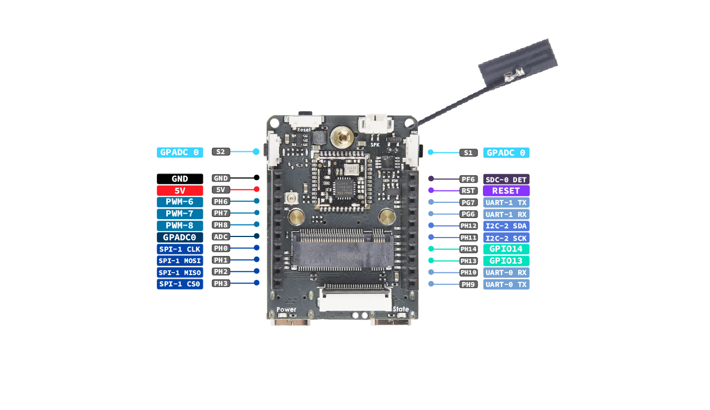

## 什么是 I2C 总线

1. I2C总线是由Philips公司开发的一种简单、双向二线制同步串行总线。它只需要两根线即可在连接于总线上的设备之间传送信息。
2. 主设备用于启动总线传送数据，并产生时钟以开放传送的设备，此时任何被寻址的设备均被认为是从设备．总线上主设备和从设备、发数据设备和收数据设备的关系不是恒定的，而取决于此时数据传送方向。
3. 如果主设备要发送数据给从设备，则主设备首先要寻址从设备，然后主动发送数据至从设备，最后由主设备终止数据传送；如果主设备要接收从设备的数据，首先由主设备寻址从设备．然后主设备接收从设备发送的数据，最后由主设备终止接收过程。在这种情况下．主机负责产生定时时钟和终止数据传送。

## I2C 通信设备原理

1. 硬件结构：通信只需要两根传输线，结构上及其简单。
    - SCL(serial clock)：时钟线，传输CLK信号，一般是I2C主设备向从设备提供时钟的通道。
    - SDA(serial data): 数据线，通信数据都通过SDA线传输。

2. 通信特征：串行、同步、非差分、低速率
    - I2C 属于串行通信，所有的数据以位为单位在SDA线上串行传输。
    - 同步通信就是通信双方工作在同一个时钟下，一般是通信的 A 方通过一根 CLK 信号线传输 A 自己的时钟给 B，B 工作在 A 传输的时钟下。所以同步通信的显著特征就是：通信线中有 CLK
    - 非差分。因为 I2C 通信速率不高，而且通信双方距离很近，所以使用电平信号通信。
    - 低速率。I2C 一般是用在同一个板子上的2个 IC 之间的通信，而且用来传输的数据量不大，所以本身通信速率很低（一般几百KHz，不同的 I2C 芯片的通信速率可能不同，具体在编程的时候要看自己所使用的设备允许的 I2C 通信最高速率，不能超过这个速率）

3. 通信方向：主设备+从设备
    - I2C 通信的时候，通信双方地位是不对等的，而是分主设备和从设备。通信由主设备发起，由主设备主导，从设备只是按照 I2C 协议被动的接受主设备的通信，并及时响应。
    - 谁是主设备、谁是从设备是由通信双方来定的（ I2C 协议并无规定），一般来说一个芯片可以只能做主设备、也可以只能做从设备、也可以既能当主设备又能当从设备（软件配置）。

4. 一对多通信
    - I2C 通信可以一对一（1个主设备对1个从设备），也可以一对多（1个主设备对多个从设备）。
    - 主设备来负责调度总线，决定某一时间和哪个从设备通信。注意：同一时间内，I2C的总线上只能传输一对设备的通信信息，所以同一时间只能有一个从设备和主设备通信，其他从设备处于“冬眠”状态，不能出来捣乱，否则通信就乱套了。
    - 每一个 I2C 从设备在通信中都有一个 I2C 从设备地址，这个设备地址是从设备本身固有的属性，然后通信时主设备需要知道自己将要通信的那个从设备的地址，然后在通信中通过地址来甄别是不是自己要找的那个从设备。（这个地址是一个电路板上唯一的，不是全球唯一的）

5. 主要用途
    - 主要用途：SoC 和周边外设之间的通信（典型的如 EEPROM、电容触摸 IC、各种 sensor 等）


> 原文链接：https://blog.csdn.net/weixin_46089486/article/details/108992588

## 如何使用 I2C 

通过查看开发板上的管脚引出 I2C 相关引脚，管脚图中得 TWI 对应的就是 I2C 管脚



```python
from maix import i2c
i2c = i2c.I2CDevice('/dev/i2c-2', 0x26)
print(i2c)
print(i2c.read(0x1, 1))

accel = MSA301(i2c)
accel.enable_tap_detection()

while True:
  print("%f %f %f" % accel.acceleration)
  print(accel.tapped)
```
> 以上是 MaixII-Dock 开发板的板载三轴加速度传感器部分代码，完整代码在 [Github](https://github.com/sipeed/MaixPy3/blob/master/examples/maix_v831/usage/usage_v831_i2c-2.py)

对于 I2C 别的使用方法，可以查看 Maixpy3 在 Github 上的源码